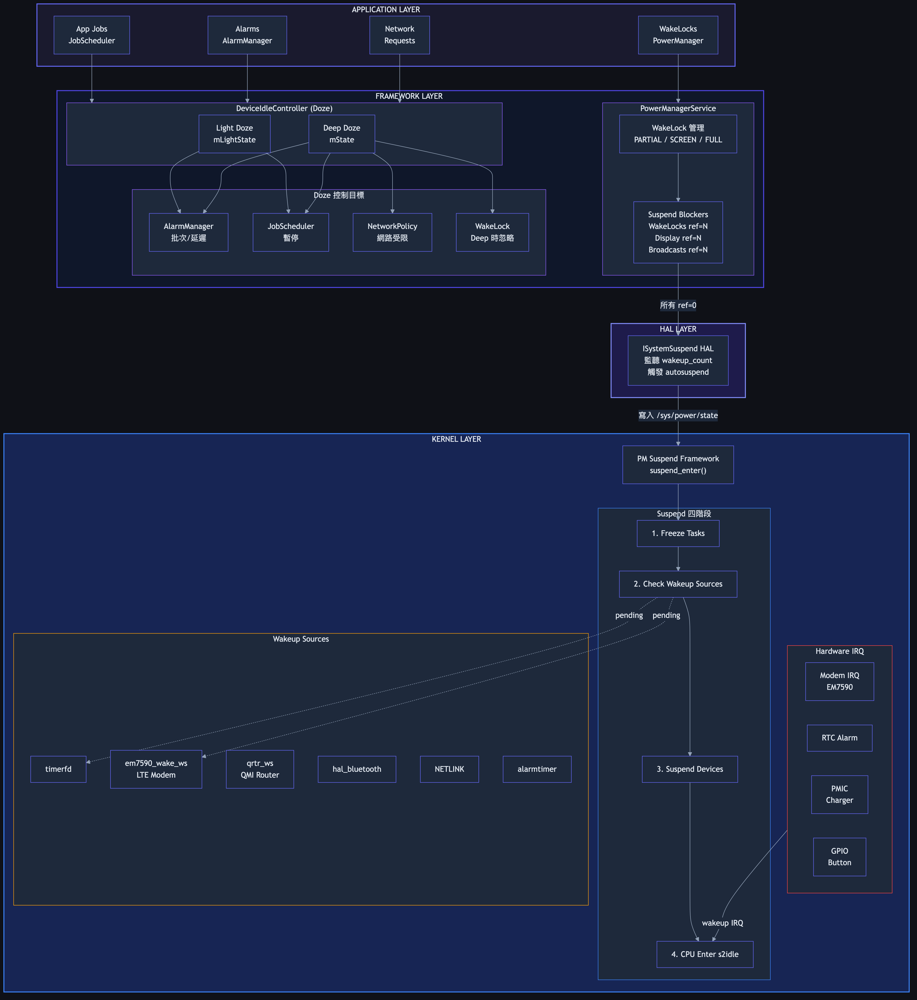
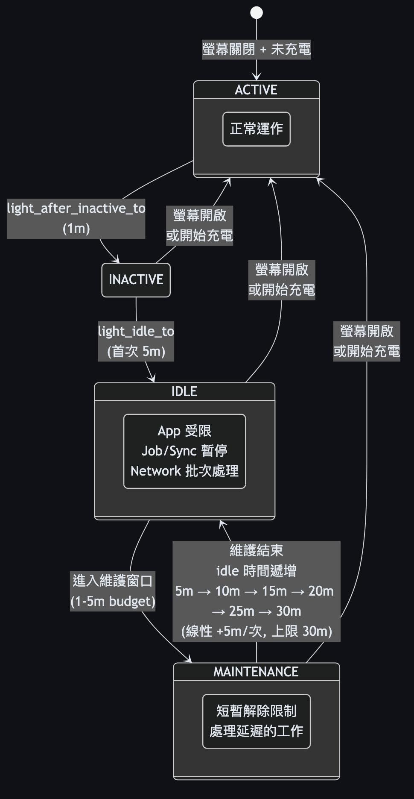
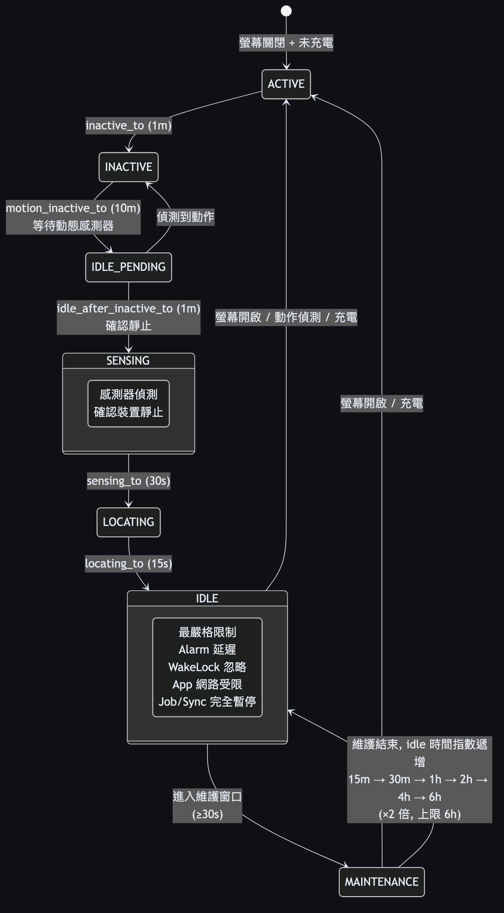
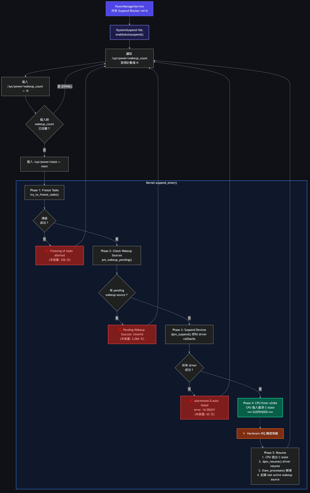
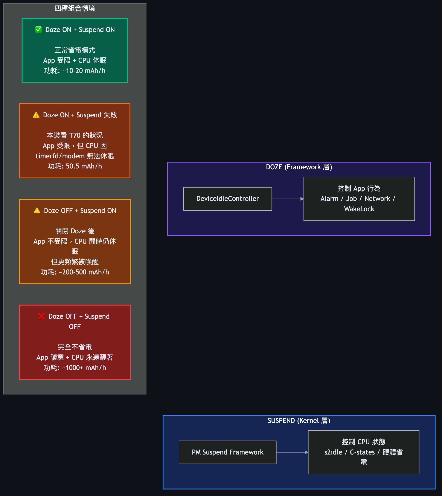
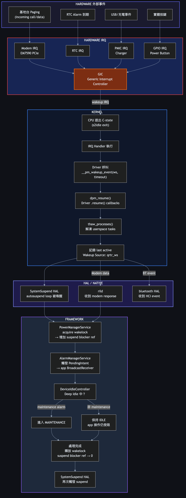
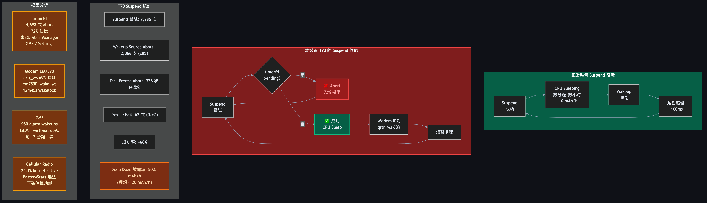

# Android 15 Power Management 完整流程圖

**適用版本**: Android 15 (API 35), Kernel 5.4+
**參考裝置**: Trimble T70, Qualcomm SoC, Sierra EM7590 Modem

---

## 1. 全局架構總覽



<details>
<summary>ASCII 版本（點擊展開）</summary>

```
┌─────────────────────────────────────────────────────────────────────┐
│                     APPLICATION LAYER                               │
│  ┌──────────┐  ┌──────────┐  ┌───────────┐  ┌───────────────────┐  │
│  │ App Jobs  │  │ Alarms   │  │ WakeLocks │  │ Network Requests  │  │
│  └────┬─────┘  └────┬─────┘  └─────┬─────┘  └────────┬──────────┘  │
│       │              │              │                  │             │
├───────┼──────────────┼──────────────┼──────────────────┼─────────────┤
│       ▼              ▼              ▼                  ▼             │
│                  FRAMEWORK LAYER (system_server)                     │
│                                                                     │
│  ┌──────────────────────────────────────────────────────────────┐   │
│  │              DeviceIdleController (Doze)                      │   │
│  │  ┌─────────────────────┐  ┌──────────────────────────────┐   │   │
│  │  │ Light Doze 狀態機    │  │ Deep Doze 狀態機              │   │   │
│  │  │ (mLightState)       │  │ (mState)                     │   │   │
│  │  └─────────┬───────────┘  └──────────────┬───────────────┘   │   │
│  │            │ 控制                         │ 控制              │   │
│  │            ▼                              ▼                   │   │
│  │  ┌─────────────┐ ┌────────────┐ ┌─────────────┐ ┌────────┐  │   │
│  │  │AlarmManager │ │JobScheduler│ │ConnectivityMgr│ │WL忽略 │  │   │
│  │  │ 批次/延遲   │ │ 暫停       │ │ 網路受限     │ │(Deep) │  │   │
│  │  └─────────────┘ └────────────┘ └─────────────┘ └────────┘  │   │
│  └──────────────────────────────────────────────────────────────┘   │
│                                                                     │
│  ┌──────────────────────────────────────────────────────────────┐   │
│  │              PowerManagerService (PMS)                        │   │
│  │                                                              │   │
│  │  ┌────────────────────┐    ┌─────────────────────────────┐   │   │
│  │  │ WakeLock 管理       │    │ Suspend Blocker 機制         │   │
│  │  │                    │    │                             │   │   │
│  │  │ PARTIAL_WAKE_LOCK  │    │ • PMS.WakeLocks    ref=N   │   │   │
│  │  │ SCREEN_DIM_LOCK    │    │ • PMS.Display      ref=N   │   │   │
│  │  │ SCREEN_BRIGHT_LOCK │    │ • PMS.Broadcasts   ref=N   │   │   │
│  │  │ FULL_WAKE_LOCK     │    │ • PMS.Booting      ref=N   │   │   │
│  │  │ DOZE_WAKE_LOCK     │    │                             │   │   │
│  │  └────────┬───────────┘    └──────────────┬──────────────┘   │   │
│  │           │                               │                  │   │
│  │           │  有 partial WL 持有？          │ 所有 ref=0？     │   │
│  │           │  → ref count++               │ → 允許 suspend    │   │
│  │           │  → 寫入 /sys/.../wake_lock   │                  │   │
│  │           └───────────────────────────────┘                  │   │
│  └──────────────────────────────────────────────────────────────┘   │
│                              │                                      │
├──────────────────────────────┼──────────────────────────────────────┤
│                              ▼                                      │
│                     HAL LAYER                                       │
│  ┌──────────────────────────────────────────────────────────────┐   │
│  │          ISystemSuspend (AIDL HAL, Android 15)               │   │
│  │                                                              │   │
│  │  • 監聽 /sys/power/wakeup_count                              │   │
│  │  • 所有 suspend blocker 釋放後觸發 autosuspend               │   │
│  │  • 寫入 wakeup_count → 寫入 /sys/power/state = "mem"        │   │
│  └──────────────────────────────┬───────────────────────────────┘   │
│                                 │                                   │
├─────────────────────────────────┼───────────────────────────────────┤
│                                 ▼                                   │
│                     KERNEL LAYER                                    │
│  ┌──────────────────────────────────────────────────────────────┐   │
│  │                    PM Suspend Framework                       │   │
│  │                                                              │   │
│  │  /sys/power/state ← "mem"                                    │   │
│  │       │                                                      │   │
│  │       ▼                                                      │   │
│  │  suspend_enter()                                             │   │
│  │       │                                                      │   │
│  │       ├─→ pm_suspend_default_s2idle() [本裝置使用 s2idle]     │   │
│  │       │                                                      │   │
│  │       ├─ 1. Freeze userspace tasks                           │   │
│  │       │     └─ 失敗 → "Freezing of tasks aborted" (326次)    │   │
│  │       │                                                      │   │
│  │       ├─ 2. 檢查 wakeup_sources                              │   │
│  │       │     └─ 有 pending → "Pending Wakeup Sources" (2,066) │   │
│  │       │                                                      │   │
│  │       ├─ 3. Suspend devices (driver callbacks)               │   │
│  │       │     └─ 失敗 → "failed to suspend: -16" (62次)        │   │
│  │       │                                                      │   │
│  │       └─ 4. CPU 進入低功耗狀態 (s2idle/C-states)             │   │
│  │                                                              │   │
│  │  ┌─────────────────────────────────────────────────────┐     │   │
│  │  │              Wakeup Source Framework                  │     │   │
│  │  │                                                     │     │   │
│  │  │  每個 wakeup source 可以：                           │     │   │
│  │  │  • __pm_stay_awake()  — 阻止 suspend                │     │   │
│  │  │  • __pm_relax()       — 允許 suspend                 │     │   │
│  │  │  • __pm_wakeup_event() — 帶超時的喚醒               │     │   │
│  │  │                                                     │     │   │
│  │  │  常見 wakeup sources (本裝置):                       │     │   │
│  │  │  • timerfd          (userspace timer)                │     │   │
│  │  │  • em7590_wake_ws   (LTE Modem)                     │     │   │
│  │  │  • qrtr_ws          (QMI Router)                    │     │   │
│  │  │  • hal_bluetooth    (BT HAL)                        │     │   │
│  │  │  • NETLINK          (netlink socket)                │     │   │
│  │  │  • alarmtimer       (kernel alarm)                  │     │   │
│  │  │  • bq40z50-monitor  (battery gauge IC)              │     │   │
│  │  └─────────────────────────────────────────────────────┘     │   │
│  └──────────────────────────────────────────────────────────────┘   │
│                                                                     │
│  ┌──────────────────────────────────────────────────────────────┐   │
│  │                    Hardware IRQ (喚醒路徑)                    │   │
│  │                                                              │   │
│  │  GIC (Generic Interrupt Controller)                          │   │
│  │       │                                                      │   │
│  │       ├─ Modem IRQ (EM7590 via PCIe/USB)  ← 基地台 paging   │   │
│  │       ├─ UART IRQ (qup_uart 99c000)       ← 串口裝置        │   │
│  │       ├─ PMIC IRQ (battery/charger)       ← 充電事件        │   │
│  │       ├─ GPIO IRQ (power button, etc.)    ← 實體按鍵        │   │
│  │       ├─ RTC IRQ (alarm timer)            ← 系統鬧鐘        │   │
│  │       └─ BT IRQ (wcn6750)                 ← 藍牙事件        │   │
│  └──────────────────────────────────────────────────────────────┘   │
└─────────────────────────────────────────────────────────────────────┘
```

</details>

---

## 2. DeviceIdleController (Doze) 狀態機

### 2.1 Light Doze 狀態機



<details>
<summary>ASCII 版本（點擊展開）</summary>

```
                    螢幕關閉 + 未充電
                          │
                          ▼
                    ┌───────────┐
              ┌─────│  ACTIVE   │
              │     └─────┬─────┘
              │           │ light_after_inactive_to (1m)
              │           ▼
              │     ┌───────────┐
              │     │ INACTIVE  │
              │     └─────┬─────┘
              │           │ light_idle_to (5m, 首次)
              │           ▼
              │     ┌───────────┐
螢幕開啟 ─────┤     │IDLE (Light)│◄──────────────────────┐
或充電        │     └─────┬─────┘                        │
              │           │                              │
              │           │ 進入維護窗口                   │
              │           ▼                              │
              │     ┌──────────────┐                     │
              │     │ MAINTENANCE  │─────────────────────┘
              │     │  (1-5m)      │  維護結束，idle 時間遞增：
              │     └──────────────┘  5m → 10m → 15m → 20m → 25m → 30m (上限)
              │                       (線性 +5m, light_idle_increase_linearly=true)
              │
              └──→ 回到 ACTIVE
```

</details>

### 2.2 Deep Doze 狀態機



<details>
<summary>ASCII 版本（點擊展開）</summary>

```
                    螢幕關閉 + 未充電
                          │
                          ▼
                    ┌───────────┐
              ┌─────│  ACTIVE   │
              │     └─────┬─────┘
              │           │ inactive_to (1m) ← 本裝置已從 AOSP 30m 縮短
              │           ▼
              │     ┌───────────┐
              │     │ INACTIVE  │
              │     └─────┬─────┘
              │           │ motion_inactive_to (10m) — 等待動態感測器
              │           ▼
              │     ┌───────────┐        偵測到動作
              │     │IDLE_PENDING│──────────────────────┐
              │     └─────┬─────┘                       │
              │           │ idle_after_inactive_to (1m) │
              │           ▼                             │
              │     ┌───────────┐                       │
              │     │ SENSING   │ sensing_to (30s)      │
              │     └─────┬─────┘                       │
              │           │                             │
              │           ▼                             │
              │     ┌───────────┐                       │
              │     │ LOCATING  │ locating_to (15s)     │
              │     └─────┬─────┘                       │
              │           │                             │
              │           ▼                             │
              │     ┌───────────┐                       │
螢幕開啟 ─────┤     │IDLE (Deep) │◄─────────────┐       │
動作偵測 ─────┤     └─────┬─────┘              │       │
或充電        │           │                    │       │
              │           │ 進入維護窗口        │       │
              │           ▼                    │       │
              │     ┌──────────────┐           │       │
              │     │ MAINTENANCE  │───────────┘       │
              │     │  (≥30s)      │  idle 時間指數遞增：│
              │     └──────────────┘  15m → 30m → 1h   │
              │                       → 2h → 4h → 6h   │
              │                       (×2, max 6h)     │
              │                                        │
              └──→ 回到 ACTIVE ◄───────────────────────┘
```

</details>

### 2.3 Doze 對各子系統的控制

```
                     DeviceIdleController
                            │
            ┌───────────────┼───────────────────┐
            │               │                   │
            ▼               ▼                   ▼
    ┌──────────────┐ ┌────────────┐  ┌──────────────────┐
    │ AlarmManager │ │JobScheduler│  │  NetworkPolicy    │
    │              │ │            │  │                  │
    │ Light Doze:  │ │ Light:     │  │ Light Doze:      │
    │  延遲非exact │ │  暫停      │  │  批次處理         │
    │              │ │            │  │                  │
    │ Deep Doze:   │ │ Deep:      │  │ Deep Doze:       │
    │  全部延遲    │ │  完全暫停  │  │  App 網路受限     │
    │  (除alarm    │ │            │  │  (FCM high-pri   │
    │   Clock)     │ │            │  │   仍可送達)       │
    └──────────────┘ └────────────┘  └──────────────────┘

    ┌──────────────┐ ┌────────────┐  ┌──────────────────┐
    │ SyncManager  │ │ WakeLock   │  │   Whitelist      │
    │              │ │ (PMS)      │  │                  │
    │ Light Doze:  │ │            │  │ 不受 Doze 限制:   │
    │  延遲        │ │ Light:     │  │ • GMS            │
    │              │ │  正常      │  │ • system apps    │
    │ Deep Doze:   │ │            │  │ • 使用者手動加入  │
    │  完全暫停    │ │ Deep:      │  │                  │
    │              │ │  **忽略**  │  │ 可用：            │
    │              │ │  PARTIAL   │  │ setAlarmClock()  │
    │              │ │  WL 無效   │  │ setExactAndAllow │
    └──────────────┘ └────────────┘  │ WhileIdle() 9m/次│
                                     └──────────────────┘
```

---

## 3. System Suspend 完整流程

### 3.1 從 Framework 到 Kernel 的 Suspend 路徑



<details>
<summary>ASCII 版本（點擊展開）</summary>

```
PowerManagerService
       │
       │ updatePowerStateLocked()
       │ 判斷是否所有 suspend blocker 都已釋放
       │
       ├─ PMS.Display ref > 0？      → 不 suspend（螢幕亮著）
       ├─ PMS.WakeLocks ref > 0？    → 不 suspend（有 partial WL）
       ├─ PMS.Broadcasts ref > 0？   → 不 suspend（有廣播在處理）
       │
       │ 全部 ref = 0
       │
       ▼
ISystemSuspend HAL (system/hardware/interfaces/suspend/)
       │
       │ enableAutosuspend()
       │
       ▼
┌──────────────────────────────────────────────────────┐
│ Autosuspend Thread (loop)                            │
│                                                      │
│  while (true) {                                      │
│    1. 讀取 /sys/power/wakeup_count → 取得計數值 N    │
│    2. 寫入 /sys/power/wakeup_count ← N              │
│       │                                              │
│       ├─ 若寫入時 wakeup_count 已改變                │
│       │   → 寫入失敗 (EINVAL)                        │
│       │   → 表示在讀和寫之間有新的 wakeup 發生        │
│       │   → 回到步驟 1 重試                          │
│       │                                              │
│       ├─ 寫入成功                                    │
│       │   ↓                                          │
│    3. 寫入 /sys/power/state ← "mem"                  │
│       │                                              │
│       ▼                                              │
│    ┌─────────────────────────────────────────┐       │
│    │          KERNEL: suspend_enter()         │       │
│    │                                         │       │
│    │  Phase 1: Freeze Tasks                  │       │
│    │  ┌─────────────────────────────────┐    │       │
│    │  │ try_to_freeze_tasks()           │    │       │
│    │  │   │                             │    │       │
│    │  │   ├─ 成功：所有 userspace 凍結   │    │       │
│    │  │   │                             │    │       │
│    │  │   └─ 失敗：                     │    │       │
│    │  │      "Freezing of tasks aborted"│    │       │
│    │  │      有 task 無法在時限內凍結     │    │       │
│    │  │      → abort suspend            │    │       │
│    │  └─────────────────────────────────┘    │       │
│    │                 │ 成功                   │       │
│    │                 ▼                       │       │
│    │  Phase 2: Check Wakeup Sources          │       │
│    │  ┌─────────────────────────────────┐    │       │
│    │  │ pm_wakeup_pending()             │    │       │
│    │  │   │                             │    │       │
│    │  │   ├─ 無 pending：繼續            │    │       │
│    │  │   │                             │    │       │
│    │  │   └─ 有 pending：               │    │       │
│    │  │      "Pending Wakeup Sources:   │    │       │
│    │  │       timerfd"                  │    │       │
│    │  │      → abort suspend            │    │       │
│    │  └─────────────────────────────────┘    │       │
│    │                 │ 無 pending             │       │
│    │                 ▼                       │       │
│    │  Phase 3: Suspend Devices               │       │
│    │  ┌─────────────────────────────────┐    │       │
│    │  │ dpm_suspend() — 呼叫每個 driver  │    │       │
│    │  │ 的 .suspend() callback          │    │       │
│    │  │   │                             │    │       │
│    │  │   ├─ 全部成功：繼續              │    │       │
│    │  │   │                             │    │       │
│    │  │   └─ 某 driver 回傳錯誤：        │    │       │
│    │  │      "alarmtimer.0.auto failed  │    │       │
│    │  │       to suspend: error -16"    │    │       │
│    │  │      → abort, resume 已 suspend │    │       │
│    │  │        的 device                │    │       │
│    │  └─────────────────────────────────┘    │       │
│    │                 │ 全部成功               │       │
│    │                 ▼                       │       │
│    │  Phase 4: Enter Low Power State         │       │
│    │  ┌─────────────────────────────────┐    │       │
│    │  │ suspend_enter_final()           │    │       │
│    │  │                                 │    │       │
│    │  │  s2idle (freeze):               │    │       │
│    │  │  • CPU 進入最深 C-state          │    │       │
│    │  │  • 等待 wakeup IRQ              │    │       │
│    │  │  • 功耗降至最低                  │    │       │
│    │  │                                 │    │       │
│    │  │  ══════ CPU SUSPENDED ══════    │    │       │
│    │  │                                 │    │       │
│    │  │  ← Hardware IRQ 觸發喚醒        │    │       │
│    │  └─────────────────────────────────┘    │       │
│    │                 │                       │       │
│    │                 ▼                       │       │
│    │  Phase 5: Resume (逆序)                 │       │
│    │  ┌─────────────────────────────────┐    │       │
│    │  │ 1. CPU 退出 C-state             │    │       │
│    │  │ 2. dpm_resume() — driver resume │    │       │
│    │  │ 3. thaw_processes() — 解凍 task │    │       │
│    │  │ 4. 記錄 last active wakeup src  │    │       │
│    │  └─────────────────────────────────┘    │       │
│    └─────────────────────────────────────────┘       │
│                                                      │
│    4. Resume 完成，回到 loop 頂部                      │
│  }                                                   │
└──────────────────────────────────────────────────────┘
```

</details>

### 3.2 Wakeup Source 生命週期

```
    Driver/Subsystem 建立 wakeup source
              │
              ▼
    wakeup_source_register("em7590_wake_ws")
              │
              │
    ┌─────────┼─────────────────────────────────────┐
    │         ▼                                     │
    │  ┌─────────────┐      ┌──────────────────┐    │
    │  │   INACTIVE   │      │     ACTIVE       │    │
    │  │              │      │                  │    │
    │  │ 不阻擋       │ stay │ 阻擋 suspend     │    │
    │  │ suspend     │─────→│                  │    │
    │  │              │awake │ pending_count++  │    │
    │  │              │      │                  │    │
    │  │              │◄─────│                  │    │
    │  │              │relax │                  │    │
    │  └─────────────┘      └──────────────────┘    │
    │                                               │
    │  wakeup_event(timeout):                       │
    │  ┌─────────────┐      ┌──────────────────┐    │
    │  │   INACTIVE   │─────→│ ACTIVE (timed)   │    │
    │  │              │event │                  │    │
    │  │              │      │ timeout 後自動    │    │
    │  │              │◄─────│ 回到 INACTIVE     │    │
    │  └─────────────┘expire└──────────────────┘    │
    │                                               │
    └───────────────────────────────────────────────┘

    Suspend 路徑中的檢查點：
    ┌────────────────────────────────────────────────┐
    │ pm_wakeup_pending() 遍歷所有 wakeup sources：  │
    │                                                │
    │  for each ws in registered_wakeup_sources:     │
    │    if ws.active:                               │
    │      → suspend abort                           │
    │      → 印出 "Pending Wakeup Sources: {name}"   │
    │                                                │
    │  本裝置主要 pending sources:                    │
    │  • timerfd (72%) ← AlarmManager / userspace    │
    │  • (unnamed) (29%) ← 匿名 wakeup source       │
    │  • battery_charger (0.8%)                      │
    │  • qup_uart (0.5%)                             │
    └────────────────────────────────────────────────┘
```

---

## 4. Doze + Suspend 的交互關係



<details>
<summary>ASCII 版本（點擊展開）</summary>

```
┌────────────────────────────────────────────────────────────────┐
│                                                                │
│   重要觀念：Doze 和 Suspend 是「獨立的兩層機制」                │
│                                                                │
│   • Doze = Framework 層，控制 app 行為（alarm, job, network）  │
│   • Suspend = Kernel 層，控制 CPU 是否進入低功耗狀態            │
│                                                                │
│   兩者可以獨立運作：                                            │
│   • Doze OFF + Suspend ON = app 不受限，但 CPU 閒置時仍 suspend│
│   • Doze ON + Suspend 失敗 = app 受限，但 CPU 因 wakeup source│
│                              無法真正睡眠                      │
│                                                                │
└────────────────────────────────────────────────────────────────┘

時間線範例（本裝置 T70 的典型行為）：

     螢幕關閉                                              螢幕開啟
        │                                                    │
        ▼                                                    ▼
時間 ─────────────────────────────────────────────────────────────
        │    │         │                    │         │       │
Doze:   │ 1m │  Light  │    Deep Doze       │  Maint  │ Deep  │
        │    │  Doze   │    (IDLE)          │ Window  │ Doze  │
        ├────┴─────────┴────────────────────┴─────────┴───────┤
        │                                                     │
Suspend:│ S R S R S──R S──────R S─R S──────R S──R S───────R S │
        │ u e u e u  e u      e u e u      e u  e u       e u │
        │ s s s s s  s s      s s s s      s s  s s       s s │
        │ p u p u p  u p      u p u p      u p  u p       u p │
        │                                                     │
        │ ↑ ↑ ↑ ↑ ↑  ↑                    ↑    ↑            │
        │ │ │ │ │ │  │                    │    │             │
        │ │ │ │ │ │  timerfd             modem  alarm        │
        │ │ │ │ │ abort                  IRQ    wakeup       │
        │ │ │ │ abort(timerfd)                               │
        │ │ │ modem IRQ                                      │
        │ │ timerfd abort                                    │
        │ 成功 suspend                                       │
        │                                                     │

圖例：
  S = suspend 嘗試
  R = resume (成功喚醒) 或 abort (suspend 失敗)
  ── = CPU sleeping (suspend 成功期間)
  空白 = CPU awake
```

</details>

---

## 5. 喚醒路徑（Hardware → Framework）



<details>
<summary>ASCII 版本（點擊展開）</summary>

```
                        ┌──────────────────┐
                        │ 外部事件觸發      │
                        │ (基地台 paging,   │
                        │  RTC alarm,      │
                        │  USB event...)   │
                        └────────┬─────────┘
                                 │
                                 ▼
┌──────────────────────────────────────────────────────────────┐
│ HARDWARE                                                     │
│                                                              │
│  Modem (EM7590)    RTC         PMIC        GPIO              │
│  PCIe/USB IRQ      alarm IRQ   charger IRQ  button IRQ       │
│       │              │           │            │               │
│       └──────────────┴───────────┴────────────┘               │
│                      │                                        │
│                      ▼                                        │
│              GIC (中斷控制器)                                   │
│                      │                                        │
│                      │ wakeup IRQ                             │
│                      ▼                                        │
└──────────────────────────────────────────────────────────────┘
                       │
                       ▼
┌──────────────────────────────────────────────────────────────┐
│ KERNEL                                                       │
│                                                              │
│  1. CPU 退出 C-state (s2idle exit)                           │
│  2. IRQ handler 執行                                         │
│  3. Driver 呼叫 __pm_wakeup_event(ws, timeout_ms)           │
│     → 建立 timed wakeup source，阻止立即再次 suspend          │
│  4. dpm_resume_noirq() → dpm_resume() → driver .resume()    │
│  5. thaw_processes() → 解凍所有 userspace task               │
│  6. 記錄 "last active Wakeup Source: qrtr_ws"               │
│                                                              │
│  如果是 RTC alarm → kernel alarm timer 觸發                  │
│  如果是 Modem → QMI message 透過 qrtr socket 傳遞            │
│                                                              │
└──────────────────────────────────────────────────────────────┘
                       │
                       ▼
┌──────────────────────────────────────────────────────────────┐
│ HAL / NATIVE                                                 │
│                                                              │
│  SystemSuspend HAL: autosuspend loop 被喚醒                   │
│  → wakeup_count 改變 → 繼續 loop                             │
│                                                              │
│  如果是 Modem → rild 收到 unsolicited response               │
│  如果是 BT → bluetooth HAL 收到 HCI event                    │
│                                                              │
└──────────────────────────────────────────────────────────────┘
                       │
                       ▼
┌──────────────────────────────────────────────────────────────┐
│ FRAMEWORK                                                    │
│                                                              │
│  PowerManagerService:                                        │
│    如果有 wakelock acquire → 增加 suspend blocker ref         │
│    → 暫時阻止再次 suspend                                    │
│                                                              │
│  AlarmManagerService:                                        │
│    如果是 RTC alarm → 觸發 PendingIntent                     │
│    → app 的 BroadcastReceiver.onReceive()                    │
│    → 持有 alarm wakelock (自動 ~10s timeout)                 │
│                                                              │
│  DeviceIdleController:                                       │
│    如果正在 Deep Idle → 檢查是否為 maintenance alarm          │
│    → 是：進入 MAINTENANCE 狀態                                │
│    → 否：保持 IDLE，app 操作仍被限制                          │
│                                                              │
│  處理完成 → 釋放 wakelock → suspend blocker ref 歸 0          │
│  → SystemSuspend HAL 再次觸發 suspend                        │
│  → 回到 kernel suspend_enter()                               │
│                                                              │
└──────────────────────────────────────────────────────────────┘
```

</details>

---

## 6. 本裝置 (T70) 的問題定位



<details>
<summary>ASCII 版本（點擊展開）</summary>

```
正常裝置的 suspend 循環：

  suspend ═══════════════════════ resume ─ suspend ═══════════════
  (CPU sleeping, 數分鐘~數小時)   (短暫)   (CPU sleeping)
  功耗: ~5-15 mAh/h                        功耗: ~5-15 mAh/h


本裝置 T70 的 suspend 循環：

  S─R S─R S═R S─R S─R S═══R S─R S─R S─R S═R S─R S═══R S─R S─R
  │ │ │ │   │ │ │     │ │ │ │ │   │     │ │ │ │ │
  │ │ │ │   │ │ │     │ │ │ │ │   │     │ │ │ │ │
  ▼ ▼ ▼ ▼   ▼ ▼ ▼     ▼ ▼ ▼ ▼ ▼   ▼     ▼ ▼ ▼ ▼ ▼
  t t t m   t t t     m t t t m   t     m t t t t
  i i i o   i i i     o i i i o   i     o i i i i
  m m m d   m m m     d m m m d   m     d m m m m
  e e e e   e e e     e e e e e   e     e e e e e
  r r r m   r r r     m r r r m   r     m r r r r

  S = suspend 嘗試
  ═ = 成功 suspend (CPU sleeping)
  ─ = abort (CPU 仍然醒著)
  t = timerfd abort
  m = modem wakeup (qrtr_ws / em7590)

  結果：CPU 大部分時間在 abort → retry → abort 循環中空轉
  實際 sleeping 時間遠低於 suspend 嘗試次數暗示的時間
  功耗: 50.5 mAh/h（應為 <20 mAh/h）
```

</details>

---

## 7. 關鍵 sysfs 與 debugfs 節點

| 節點 | 用途 | 範例 |
|------|------|------|
| `/sys/power/state` | 觸發 suspend (寫入 "mem") | `echo mem > /sys/power/state` |
| `/sys/power/wakeup_count` | wakeup 計數器，race-free suspend | 讀取後回寫相同值 |
| `/sys/power/pm_wakeup_irq` | 最後觸發喚醒的 IRQ 編號 | `cat pm_wakeup_irq` → 216 |
| `/sys/kernel/debug/wakeup_sources` | 所有 wakeup source 統計 | active_count, total_time |
| `/sys/kernel/debug/suspend_stats` | Suspend 成功/失敗統計 | success, fail, last_failed_dev |
| `/d/clk/clk_summary` | Clock tree 狀態 | 確認哪些 clock 未關閉 |
| `/sys/devices/.../power/wakeup` | 個別裝置的 wakeup 設定 | enabled/disabled |

```bash
# 查看 suspend 統計
adb shell cat /sys/kernel/debug/suspend_stats

# 查看所有 wakeup sources 及其統計
adb shell cat /sys/kernel/debug/wakeup_sources

# 查看最後喚醒的 IRQ
adb shell cat /sys/power/pm_wakeup_irq

# 禁用特定裝置的 wakeup 能力（謹慎使用）
adb shell "echo disabled > /sys/devices/.../power/wakeup"
```
